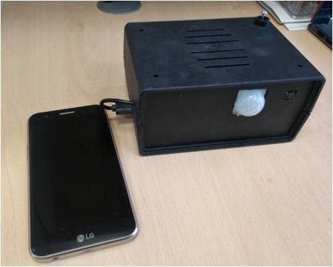
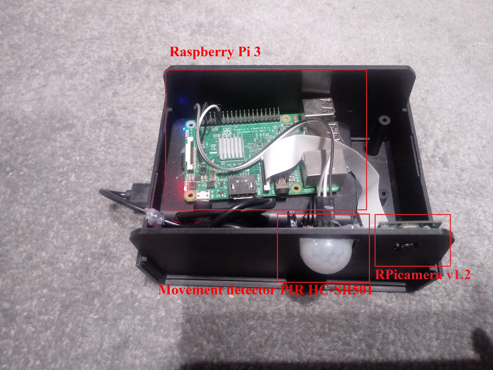

# SpyCam with Android app

The main purpose of this project was to create a spycam and a mobile application based on the Android system that would enable remote control. 
It was assumed that the camera will be used to observe animals in their natural environment.
The Raspberry Pi platform and the Python programming language were used to design and implement it.
The main function of the device is to take pictures and send them to the user's e-mail address as notification of camera's activity. 
Photos are placed on Google's disk. The spycam communicates via bluetooth with the Android application,
which allows the user to choose one of several functionalities, such as:
* the type of camera activity (photo / series of photos or video), 
* e-mail to which the user will receive notification and the 
* option to add an attachment to mail in the form of a registered image.

The project started with the construction of a photo-trap. For proper operation of the device, a camera and a motion sensor are required.
Used elements:
* Raspberry Pi model B v1.2
* RPicamera v1.2 
* To release the camera's shutter, the program must detect movement in its field of view. For this purpose, the PIR HC-SR501 motion detector was used.
* Powerbank Trust Urban primo 8800 mAh as part of the power supply
* LG K10 (2017) - smartphone with installed application

The most important data for the user is the e-mail address to which the message arrives about the activity of the camera trap. The person that operating the application can also decide whether the message should be sent with or without attachment and in what form the images from the camera are captured.

Folder 'Raspberry Pi' has the python code that supports Raspberry Pi and Spy Cam.
